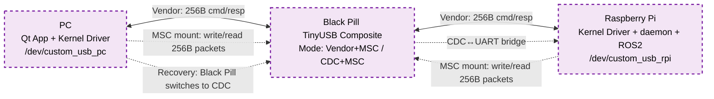
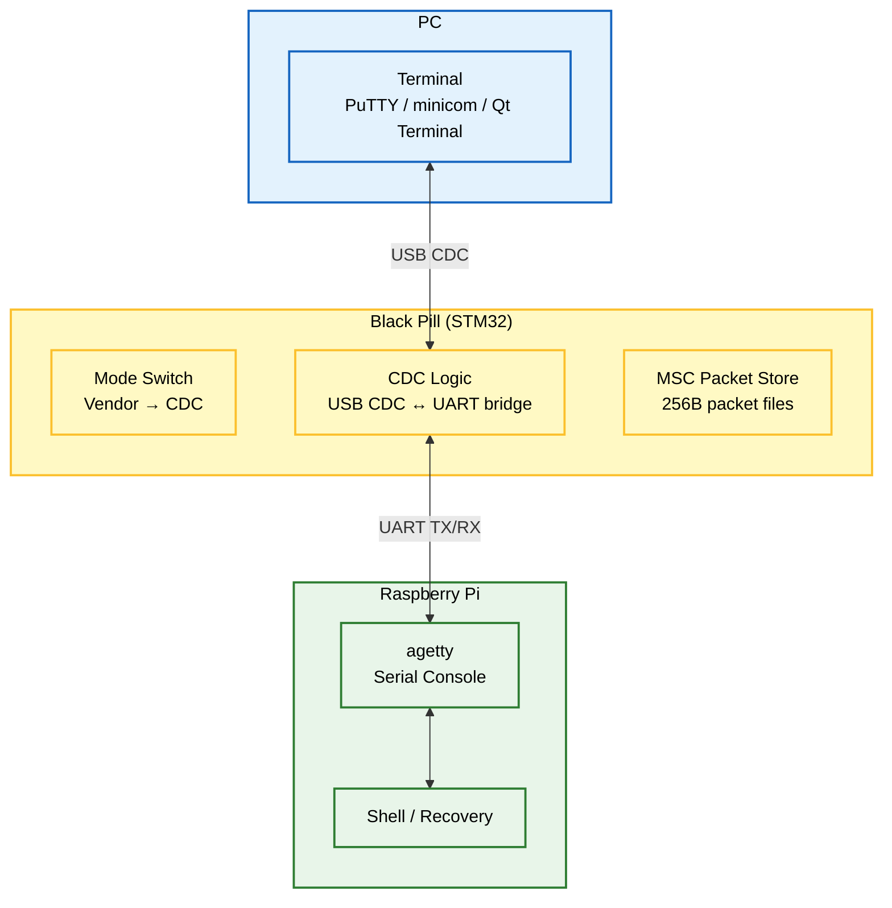
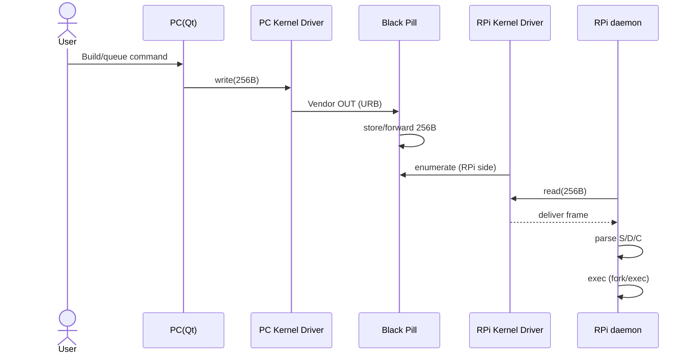

# USB-MACRO

**PC(Qt)에서 TurtleBot(Raspberry Pi)를 USB로 제어/자동화하고, 네트워크/SSH가 끊겨도 UART 시리얼 콘솔로 복구하는 Smart USB Bridge**

<center>
  
</center>

---

## ✨ 한 줄 요약

**MAIN (Vendor 256B + MSC Packet Store)**  
PC(Qt App + Linux Kernel Driver) ↔ Black Pill(TinyUSB: Vendor + MSC) ↔ Raspberry Pi(Linux Kernel Driver) ↔ daemon(명령 실행)

**RECOVERY (Serial Console over CDC↔UART, Black Pill이 CDC 모드로 전환)**  
PC(Terminal) ↔ Black Pill(CDC↔UART Bridge) ↔ Raspberry Pi(agetty) ↔ Shell(복구)

> 핵심: **Vendor 256B 명령 패킷을 커널 드라이버가 `/dev/custom_usb_*`로 노출**해서 Qt/daemon은 파일 I/O(read/write/poll)처럼 다룹니다.  
> MSC는 **256B Vendor 패킷 저장/회수(Packet Store)** 용도로 씁니다.

---

## ✅ Key Features

- **/dev 기반 제어**: libusb 없이 `read/write/poll`로 간단 제어
- **256B 고정 프레임 프로토콜**: 프레이밍/검증이 단순하고 안정적
- **MSC Packet Store**: 256B 패킷을 파일로 저장/읽기(케이블 전환/검증/재현에 유리)
- **Recovery UART Console**: 네트워크 불가 시에도 CDC↔UART로 시리얼 콘솔(agetty) 확보  
  *(Recovery 시 Black Pill이 CDC 모드로 동작)*

---

## 🏛️ 시스템 아키텍처 (System Architecture)

### Overview (한눈에)


---

<details>
<summary><b>1) 평상시 제어 모드 (Normal Operation Mode) - 상세</b></summary>

```mermaid
%%{init: {"themeVariables": {"fontSize": "16px"}, "flowchart": {"useMaxWidth": true, "nodeSpacing": 55, "rankSpacing": 75, "diagramPadding": 10}}}%%
flowchart TB
  classDef pc fill:#e3f2fd,stroke:#1565c0,stroke-width:2px,color:black;
  classDef mcu fill:#fff9c4,stroke:#fbc02d,stroke-width:2px,color:black;
  classDef rpi fill:#e8f5e9,stroke:#2e7d32,stroke-width:2px,color:black;
  classDef usb fill:#f3e5f5,stroke:#7b1fa2,stroke-width:2px,stroke-dasharray: 5 5,color:black;

  subgraph PC_Group ["PC"]
    direction TB
    QT["Qt App<br/>GUI Controller"]
    K_PC["Linux Kernel Driver<br/>/dev/custom_usb_pc"]
    QT <-->|read/write/poll| K_PC
  end

  subgraph USB_Link1 ["USB Vendor Link"]
    L_VEN1["Vendor Interface<br/>Bulk/Interrupt EP"]
  end

  subgraph STM32_Group ["Black Pill (STM32)"]
    direction TB
    FW_VEN["Vendor Logic<br/>256B passthrough + store"]
    FW_MSC["MSC Packet Store<br/>256B packets on storage"]
  end

  subgraph RPI_Group ["Raspberry Pi"]
    direction TB
    K_RPI["Linux Kernel Driver<br/>/dev/custom_usb_rpi"]
    DAEMON["daemon<br/>Parser + Executor (S/D/C)"]
    ROS2["ROS2"]
    K_RPI <==>|char dev I/O| DAEMON
    DAEMON --> ROS2
  end

  K_PC <==>|URB| L_VEN1
  L_VEN1 <==> FW_VEN
  FW_VEN <==>|URB| K_RPI

  FW_MSC -.->|mount (PC/RPi)| PC_Group
  FW_MSC -.->|mount (PC/RPi)| RPI_Group

  class PC_Group,QT,K_PC pc;
  class STM32_Group,FW_VEN,FW_MSC mcu;
  class RPI_Group,K_RPI,DAEMON,ROS2 rpi;
  class USB_Link1,L_VEN1 usb;
```

**How it works (Normal)**
- PC(Qt)가 `write(fd, 256)` → 커널 드라이버가 Vendor OUT URB로 전송
- STM32는 256B 프레임을 **저장(필요 시) + passthrough**
- RPi 커널 드라이버가 Vendor IN을 받아 `/dev/custom_usb_rpi`로 노출
- daemon이 `read()` 후 S/D/C로 실행(ROS2/시스템 명령)

</details>

---

<details>
<summary><b>2) 긴급 복구 모드 (Recovery: CDC↔UART Serial Console) - 상세</b></summary>



**How it works (Recovery)**
- Black Pill이 **CDC 모드로 전환** → PC는 가상 COM으로 접속
- CDC 데이터는 UART로 브릿지되어 RPi의 **agetty 시리얼 콘솔**로 연결
- 네트워크/SSH 없이도 로그인/복구 가능

</details>

---

## 🧱 구성 요소 (Components)

### 1) PC (Qt App)
- `/dev/custom_usb_pc`로 256B 패킷 `read/write/poll`
- (필요 시) MSC(Packet Store) 마운트해서 **패킷 파일 저장/검증/재현**

### 2) STM32 / Black Pill (Firmware)
- TinyUSB Composite: **Vendor + MSC**, (Recovery 시) **CDC + MSC**
- Vendor: 256B 프레임 송수신 + (필요 시) 저장
- MSC: 256B 패킷 저장소(Packet Store)
- CDC: Recovery에서 USB CDC ↔ UART 브릿지

### 3) Raspberry Pi + daemon
- `/dev/custom_usb_rpi`에서 256B 패킷 수신
- daemon이 `S/D/C`로 파싱 후 실행(ROS2 포함)
- Recovery에서는 agetty를 통해 시리얼 콘솔 제공

### 4) Linux Kernel Driver (PC/RPi 공용)
- USB Vendor 인터페이스를 `probe()`로 잡고 URB 송수신
- char device(`/dev/custom_usb_*`) 제공: `read/write/poll` 중심
- disconnect 시 안전 정리

---

## 🔁 작동 흐름 (Workflow)



---

## 🔌 USB Vendor Packet (256 bytes fixed)

```text
0x00 (4)   magic        = 0xDEADBEEF
0x04 (1)   info_id      = type/flags
0x05 (2)   cmd_len      = 0~249
0x07 (249) cmd bytes    = ASCII/UTF-8
Total: 256B
```

```c
#pragma pack(push, 1)
typedef struct {
    uint32_t magic;      // 0xDEADBEEF (LE)
    uint8_t  info_id;    // type/flags
    uint16_t cmd_len;    // 0~249
    char     cmd[249];   // command string
} vendor_pkt_t;
#pragma pack(pop)
```

---

## 🚀 설치 및 실행 (Setup & Usage)

> 아래는 예시. 레포 구조에 맞게 경로만 맞추면 됨.

### 1) Firmware Flash
```bash
cd firmware
make
# flash tool(ST-Link/DFU 등)로 업로드
```

### 2) Kernel Driver (PC/RPi 공용)
```bash
cd kernel_driver
make
sudo insmod custom_usb.ko
dmesg | tail
ls -l /dev/custom_usb*
```

udev rule 예시:
```bash
# /etc/udev/rules.d/99-custom-usb.rules
KERNEL=="custom_usb*", MODE="0666"
```

### 3) RPi daemon 실행
```bash
cd rpi_daemon
python3 main.py
```

### 4) PC(Qt) 실행
```bash
cd pc_client_qt
./CUSTOM_USB_CLIENT
```

### 5) Recovery 모드(Serial Console)
- Black Pill을 **Recovery(CDC) 모드로 전환**
- PC에서 COM 포트로 접속:
```bash
# 예: Linux
sudo minicom -D /dev/ttyACM0 -b 115200
```
- RPi는 agetty가 떠 있어야 함(환경에 맞게 설정)

---

## 🧯 Troubleshooting

- **`\n` 줄바꿈이 그대로 출력됨**
  - Mermaid 노드 라벨 줄바꿈은 `\n` 대신 **`<br/>`** 사용
- **자세히 보기(details)가 안 접힘**
  - `<details>` / `<summary>`는 줄바꿈 + summary 다음 빈 줄 + `</details>` 필수
- **256B read가 블록/드롭**
  - magic/len 검증, struct packing, 부분 write로 프레임 경계 깨짐 확인
- **Composite 일부만 잡힘**
  - 인터페이스 번호/드라이버 바인딩 확인(특히 Linux 자동 class driver)
- **Recovery 콘솔이 안 붙음**
  - UART 핀(TX/RX/GND), agetty 설정, 다른 프로세스가 tty 점유 중인지 확인

---

## 🗺️ Roadmap

- [ ] ACK/재전송/타임아웃(프로토콜 안정화)
- [ ] ioctl 확장(모드/에러/버퍼 상태)
- [ ] C(continuous) 프로세스 관리(stop/restart/status)
- [ ] 로그 채널 분리(cmd vs stream)

---

## 📄 License
MIT
