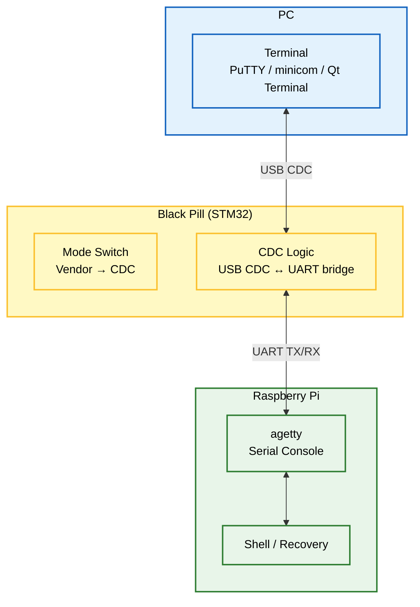
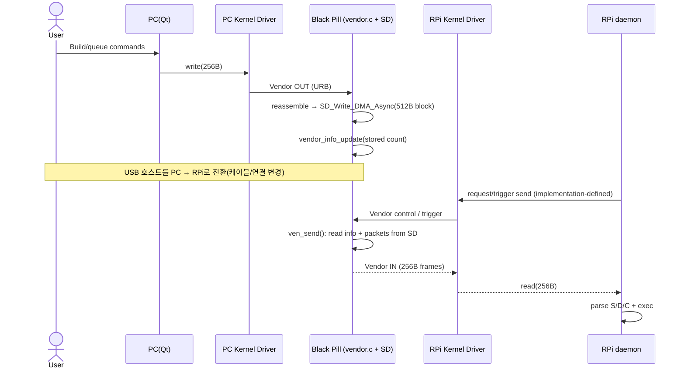

# USB-MACRO

**PC(Qt)에서 TurtleBot(Raspberry Pi)를 USB로 제어/자동화하고, 네트워크/SSH가 끊겨도 UART 시리얼 콘솔로 복구하는 Smart USB Bridge**

<center>
  
</center>

---

## ✨ 한 줄 요약

**MAIN (Vendor 256B Store-and-Forward + SD Packet Store)**  
PC(Qt App + Linux Kernel Driver) → Black Pill(TinyUSB: Vendor + MSC) → *(SD에 256B 패킷 저장)* → Raspberry Pi(Linux Kernel Driver) → daemon(명령 실행)

**RECOVERY (Serial Console over CDC↔UART, Black Pill이 CDC 모드로 전환)**  
PC(Terminal) ↔ Black Pill(CDC↔UART Bridge) ↔ Raspberry Pi(agetty) ↔ Shell(복구)

> 핵심: **Vendor로 들어온 256B 명령 패킷을 STM32가 SD(512B 블록)에 저장**해두고,  
> **RPi가 연결되면 저장된 패킷을 Vendor로 다시 전송(ven_send)**하여 daemon이 실행합니다.  

---

## ✅ Key Features

- **/dev 기반 제어**: libusb 없이 `read/write/poll`로 단순 제어
- **256B 고정 프레임**: 프레임 경계/검증이 단순
- **Store-and-Forward**: PC에서 미리 패킷을 적재 → 케이블을 RPi로 옮긴 뒤 실행
- **SD Packet Store**: Vendor로 받은 256B를 SD에 저장(블록 512B 단위 기록)
- **MSC(옵션)**: 저장된 내용을 파일/블록 단위로 확인·백업하고 싶을 때만 mount
- **Recovery UART Console**: 네트워크 불가 시에도 CDC↔UART로 시리얼 콘솔(agetty) 확보  
  *(Recovery 시 Black Pill이 CDC 모드로 동작)*

---

## 🏛️ 시스템 아키텍처 (System Architecture)

### Overview (한눈에)
```mermaid
%%{init: {"themeVariables": {"fontSize": "16px"}, "flowchart": {"useMaxWidth": true, "nodeSpacing": 45, "rankSpacing": 60, "diagramPadding": 8}}}%%
flowchart LR
  classDef pc fill:#e3f2fd,stroke:#1565c0,stroke-width:2px,color:black;
  classDef mcu fill:#fff9c4,stroke:#fbc02d,stroke-width:2px,color:black;
  classDef rpi fill:#e8f5e9,stroke:#2e7d32,stroke-width:2px,color:black;
  classDef usb fill:#f3e5f5,stroke:#7b1fa2,stroke-width:2px,stroke-dasharray: 5 5,color:black;

  PC["PC<br/>Qt App + Kernel Driver<br/>/dev/custom_usb_pc"]
  MCU["Black Pill (STM32)<br/>TinyUSB Composite<br/>Vendor + MSC<br/>SD Packet Store"]
  RPI["Raspberry Pi<br/>Kernel Driver + daemon + ROS2<br/>/dev/custom_usb_rpi"]

  PC  --> |Vendor: STORE 256B frames| MCU
  RPI --> |Vendor: FETCH stored frames (ven_send)| MCU
  MCU --> |Vendor: 256B frames| RPI

  PC  -.-> |MSC mount (optional: inspect/backup)| MCU
  RPI -.-> |MSC mount (optional: inspect/backup)| MCU

  PC  -.-> |Recovery: MCU switches to CDC| MCU
  MCU -.-> |CDC↔UART bridge| RPI

  class PC pc;
  class MCU mcu;
  class RPI rpi;
  class PC,MCU,RPI usb;
```

---

<details>
<summary><b>1) 평상시 제어 모드 (Normal Operation Mode) - 상세</b></summary>

```mermaid
%%{init: {"themeVariables": {"fontSize": "16px"}, "flowchart": {"useMaxWidth": true, "nodeSpacing": 55, "rankSpacing": 75, "diagramPadding": 10}}}%%
flowchart TB
  classDef pc fill:#e3f2fd,stroke:#1565c0,stroke-width:2px,color:black;
  classDef mcu fill:#fff9c4,stroke:#fbc02d,stroke-width:2px,color:black;
  classDef rpi fill:#e8f5e9,stroke:#2e7d32,stroke-width:2px,color:black;
  classDef sd fill:#fff3e0,stroke:#ef6c00,stroke-width:2px,color:black;
  classDef usb fill:#f3e5f5,stroke:#7b1fa2,stroke-width:2px,stroke-dasharray: 5 5,color:black;

  subgraph PC_Phase ["Phase A: PC에서 패킷 적재"]
    direction TB
    QT["Qt App<br/>Command Builder"]
    K_PC["Linux Kernel Driver<br/>/dev/custom_usb_pc"]
    QT -->|write 256B| K_PC
    K_PC -->|USB Vendor OUT : URB| FW_VEN
  end

  subgraph MCU_Group ["Black Pill (STM32)"]
    direction TB
    FW_VEN["vendor.c<br/>tud_vendor_rx_cb<br/>256B reassemble"]
    SD["SD Card 512B block<br/>SD_Write_DMA_Async"]
    INFO["info block<br/>vendor_info_update<br/>cmd_len=stored count"]
    FW_VEN -->|store 256B into 1 block| SD
    FW_VEN -->|update metadata| INFO
  end

  subgraph RPI_Phase ["Phase B: RPi에서 실행(Fetch & Execute)"]
    direction TB
    KRPI["Linux Kernel Driver<br/>/dev/custom_usb_rpi"]
    DAEMON["daemon<br/>Parser + Executor : S/D/C"]
    ROS2["ROS2"]
    KRPI -->|read(256B)| DAEMON
    DAEMON --> ROS2
  end

  RPI_CMD["RPi Trigger<br/>request send"] -->|call/trigger ven_send| MCU_SEND["ven_send()<br/>SD_Read_DMA_Async + tud_vendor_write"]

  SD --> MCU_SEND
  INFO --> MCU_SEND
  MCU_SEND -->|USB Vendor IN (256B)| KRPI

  MSC_OPT["MSC (optional)<br/>inspect/backup only"] -.-> SD

  class QT,K_PC pc;
  class FW_VEN,MCU_SEND,MCU_Group mcu;
  class KRPI,DAEMON,ROS2 rpi;
  class SD,INFO sd;
  class PC_Phase,RPI_Phase usb;
```

**How it works (Normal)**

- **PC → STM32 저장(Store)**  
  - `tud_vendor_rx_cb()`에서 **조각난 Vendor RX**를 `g_accum_buf`에 합쳐 **256B(VENPACK_SIZE)**가 되면 패킷 완성  
  - `SD_Write_DMA_Async(g_ven_header++, g_accum_buf, 1)`로 **SD에 1블록(512B) 저장**  
  - `vendor_info_update(count)`로 **info 블록(g_ven_info_addr)에 저장된 개수(cmd_len)** 갱신

- **RPi → STM32 요청(Fetch) → RPi 실행(Execute)**  
  - 트리거(버튼/키/요청 패킷 등)로 `ven_send()`가 호출되면  
  - info 블록을 읽고(`cmd_len = send_cnt`), SD에서 패킷을 순서대로 읽어 `tud_vendor_write(..., 256)`로 **Vendor IN 전송**  
  - RPi 커널 드라이버가 `/dev/custom_usb_rpi`로 노출 → daemon이 읽어 실행

> **MSC mount는 필수가 아닙니다.** 운영 경로는 Vendor store/send이며, MSC는 필요할 때만(점검/백업) 사용하세요.

</details>

---

<details>
<summary><b>2) 긴급 복구 모드 (Recovery: CDC↔UART Serial Console) - 상세</b></summary>



**How it works (Recovery)**
- Black Pill이 **CDC 모드로 전환** → PC는 가상 COM으로 접속
- CDC 데이터는 UART로 브릿지되어 RPi의 **agetty 시리얼 콘솔**로 연결
- 네트워크/SSH 없이도 로그인/복구 가능

</details>

---

## 🧱 구성 요소 (Components)

### 1) PC (Qt App)
- `/dev/custom_usb_pc`로 256B 패킷 **전송(Store)**  
- (선택) MSC를 mount해 **저장된 내용 확인/백업** (운영 필수 아님)

### 2) STM32 / Black Pill (Firmware)
- TinyUSB Composite: **Vendor + MSC**, (Recovery 시) **CDC + MSC**
- Vendor RX: `tud_vendor_rx_cb()`에서 256B 패킷 조립 후 **SD 저장**
- Vendor TX: `ven_send()`가 SD에서 읽어 **Vendor로 재전송**
- SD 메타: `vendor_info_update()`가 **info 블록에 저장 개수(cmd_len)** 저장
- MSC: 동일 SD를 호스트에 노출(점검/백업용)
- CDC: Recovery에서 USB CDC ↔ UART 브릿지

### 3) Raspberry Pi + daemon
- `/dev/custom_usb_rpi`로 들어온 256B 프레임을 daemon이 읽고 실행
- daemon이 `S/D/C`로 파싱 후 실행(ROS2 포함)
- Recovery에서는 agetty를 통해 시리얼 콘솔 제공

### 4) Linux Kernel Driver (PC/RPi 공용)
- USB Vendor 인터페이스를 `probe()`로 잡고 URB 송수신
- char device(`/dev/custom_usb_*`) 제공: `read/write/poll` 중심
- disconnect 시 안전 정리

---

## 🔁 작동 흐름 (Workflow)



---

## 🔌 USB Vendor Packet (256 bytes fixed)

```text
0x00 (4)   magic        = 0xDEADBEEF
0x04 (1)   info_id      = type/flags
0x05 (2)   cmd_len      = 0~249
0x07 (249) cmd bytes    = ASCII/UTF-8
Total: 256B
```

```c
#pragma pack(push, 1)
typedef struct {
    uint32_t magic;      // 0xDEADBEEF (LE)
    uint8_t  info_id;    // type/flags
    uint16_t cmd_len;    // 0~249
    char     cmd[249];   // command string
} vendor_pkt_t;
#pragma pack(pop)
```

> 참고: 펌웨어의 **info 블록**은 별도 `venpack_t`로 저장되며,  
> `magic=0xBEEFCAFE`, `command="info_struct"`, `cmd_len=저장된 패킷 개수` 형태로 관리됩니다.

---

## 🚀 설치 및 실행 (Setup & Usage)

> 아래는 예시. 레포 구조에 맞게 경로만 맞추면 됩니다.

### 1) Firmware Flash
```bash
cd firmware
make
# flash tool(ST-Link/DFU 등)로 업로드
```

### 2) Kernel Driver (PC/RPi 공용)
```bash
cd kernel_driver
make
sudo insmod custom_usb.ko
dmesg | tail
ls -l /dev/custom_usb*
```

udev rule 예시:
```bash
# /etc/udev/rules.d/99-custom-usb.rules
KERNEL=="custom_usb*", MODE="0666"
```

### 3) PC에서 패킷 적재(Store)
```bash
cd pc_client_qt
./CUSTOM_USB_CLIENT
# Qt에서 명령 생성 → /dev/custom_usb_pc로 256B 전송
```

### 4) RPi에서 패킷 수신/실행(Fetch & Execute)
```bash
cd rpi_daemon
python3 main.py
# (트리거 방식에 따라) ven_send 동작을 유발하면
# /dev/custom_usb_rpi로 256B 프레임이 들어오고 daemon이 실행
```

### 5) Recovery 모드(Serial Console)
- Black Pill을 **Recovery(CDC) 모드로 전환**
- PC에서 COM 포트로 접속:
```bash
# 예: Linux
sudo minicom -D /dev/ttyACM0 -b 115200
```

---

## 🧯 Troubleshooting

- **`read()`가 블록 / 패킷이 드롭됨**
  - 256B 프레임 경계 깨짐(부분 write), magic/len 검증 실패 확인
- **SD busy / Vendor가 SD보다 빠름**
  - 코드에 `[vendor] rx buffer overflow`가 뜨면 송신 측(PC)이 재전송/대기 로직 필요
  - `#ifdef ASYNC`에서 SD busy면 **다시 보내라고 에코**하는 로직이 있음(프로토콜 정리 추천)
- **DMA Async + 버퍼 재사용으로 데이터 깨짐**
  - `SD_Write_DMA_Async()` 완료 전에 `g_accum_buf`가 RX로 덮일 수 있음  
  - 더블 버퍼(핑퐁) 또는 SD 완료 콜백 기반으로 버퍼 재사용 제어 권장
- **MSC mount 중 펌웨어가 SD를 쓰면 충돌**
  - MSC로 호스트가 블록을 만지는 동안 펌웨어 SDIO 쓰기 금지(모드 분리 권장)

---

## 🗺️ Roadmap

- [ ] STORE/FETCH/LIST/ACK 등 Vendor 프로토콜 표준화
- [ ] 재전송/타임아웃/흐름제어(“SD busy” 처리)
- [ ] ioctl 확장(모드/에러/버퍼 상태)
- [ ] C(continuous) 프로세스 관리(stop/restart/status)

---

## 📄 License
MIT
